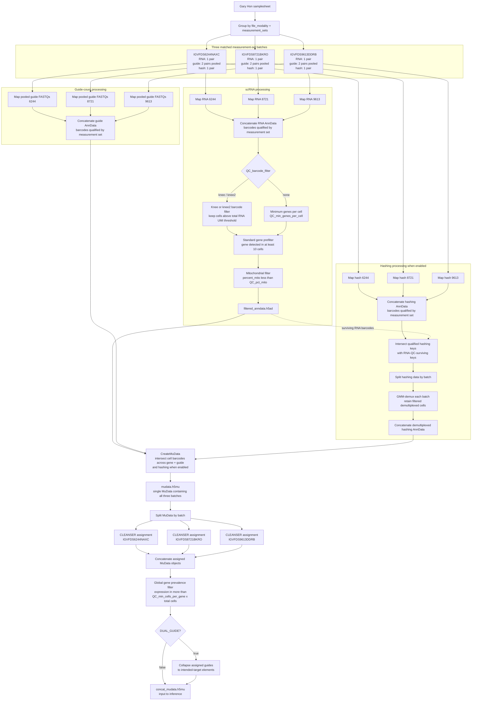
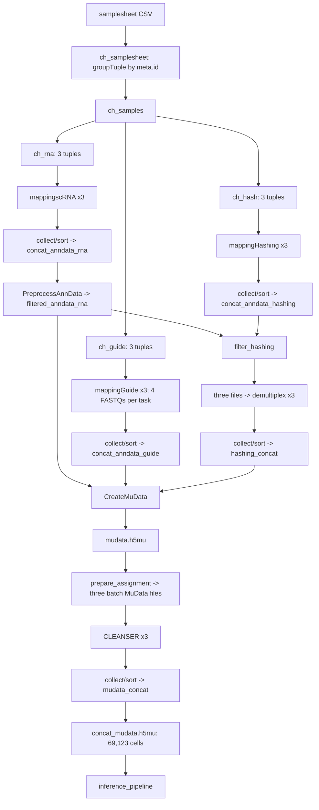

# Filtering and MuData assembly order

The Gary Hon samplesheet contains three measurement-set batches:
`IGVFDS6244NAXC`, `IGVFDS8721BKRO`, and `IGVFDS9613DDRB`. Its `lane` column is
empty, so `measurement_sets` is the key that pairs RNA, guide, and hashing data.
Each batch has one RNA FASTQ pair, two guide FASTQ pairs, and one hashing FASTQ
pair. The two guide pairs are pooled into one mapping call for that batch.

The `lane` field is not the grouping key in this checkout. It is empty for all
Gary Hon rows, and `meta.id` is built as
`sample_${file_modality}_${measurement_sets}`. Consequently, this run has one
mapping tuple per modality and measurement set, not one tuple per lane.

## Verified Nextflow channel lineage

### Evidence from the completed May 14, 2026 run

| Stage | Observed result |
| --- | --- |
| Guide mapping | The 6244 `mappingGuide` task passed four FASTQs to one `kb count`, proving that its two guide pairs were pooled. |
| Modality concatenation | RNA, guide, and hash logs all sorted measurement sets as 6244, 8721, 9613. |
| RNA QC | `PreprocessAnnData` started with 2,131,101 cells and wrote `filtered_anndata.h5ad`. |
| RNA/hash intersection | `filter_hashing` found 128,814 shared keys, then wrote one file for each measurement set. |
| Assignment split | `prepare_assignment` wrote exactly three files: one each for 6244, 8721, and 9613. |
| Final assignment concatenation | `mudata_concat` combined three files and wrote `concat_mudata.h5mu` with 69,123 cells. |

The evidence comes from the checkout at commit `47a36ce`, its `.nextflow.log`,
and task objects under `gs://igvf-pertub-seq-pipeline-data/work`.

## Important details

- Samplesheet rows are grouped by `file_modality + measurement_sets`.
- For each Gary Hon batch, the two guide rows share the same grouping key, so
  four guide FASTQ files (two R1/R2 pairs) enter one guide mapping call.
- RNA, guide, and hashing AnnData objects are physically concatenated across
  batches, but cell keys remain batch-qualified. In the updated workspace, for example,
  `AAAC..._IGVFDS6244NAXC` cannot intersect
  `AAAC..._IGVFDS8721BKRO`.
- The completed May 14, 2026 checkout used positional suffixes `_0`, `_1`, and `_2`.
  Its intersections remained same-batch because all three modality
  concatenations used the same sorted measurement-set order. The updated code
  removes that ordering dependency by using the measurement-set ID directly.
- With `QC_barcode_filter = 'knee'` or `'knee2'`, total RNA UMI depth selects
  cells and `QC_min_genes_per_cell` is skipped. With
  `QC_barcode_filter = 'none'`, the minimum-gene filter is used instead.
- The guide count matrix is not filtered by a fixed UMI cutoff before MuData
  creation. SCEPTRE or CLEANSER assigns guides from the per-cell guide counts
  after the modalities have been intersected.
- When hashing is enabled, hashing is first restricted to cells that survived
  RNA QC. `CreateMuData` then performs the final barcode intersection across
  the gene, guide, and demultiplexed hashing modalities.
- When hashing is disabled, the final intersection uses only gene and guide
  barcodes. Optional Scrublet doublet removal runs on the resulting MuData
  before guide assignment.
- `mudata.h5mu` is one combined multimodal object containing all three batches.
  It is temporarily split by `batch` (`measurement_sets`) so guide assignment
  runs independently, then recombined as `concat_mudata.h5mu`.
- `QC_min_cells_per_gene` is a fraction in `[0, 1)` and is applied after guide
  assignment and batch concatenation. A gene must be detected in strictly more
  than `QC_min_cells_per_gene * total_cells`; `0` retains every gene detected
  in at least one cell.
- `TAPSEQ_QC_MODE = true` removes the standard 10-cell preprocessing floor so
  observed TAP-seq genes reach the final fractional filter. Pair it with a very
  small fraction (for example `0.000001`) when all observed genes should be
  retained.
