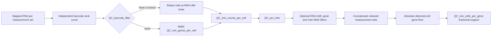
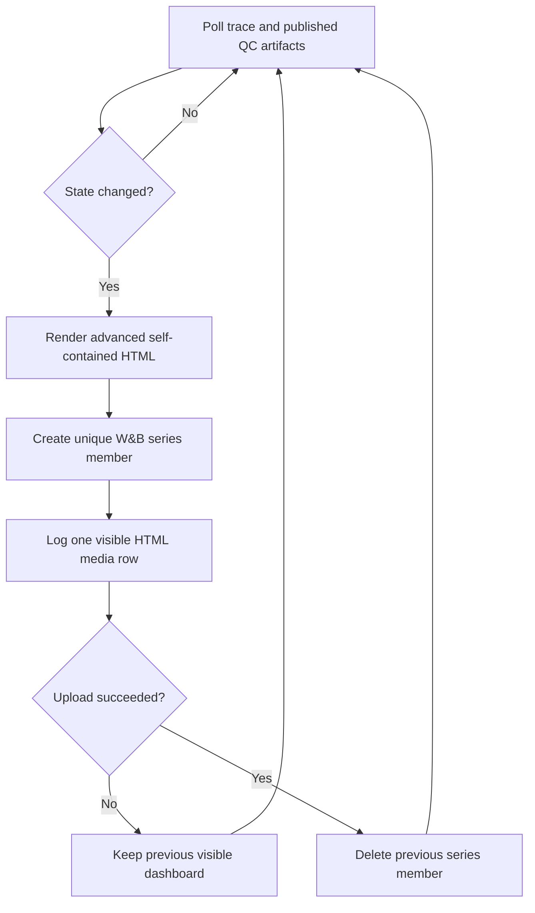

# Live W&B execution dashboard

The advanced CRISPR Pipeline execution dashboard is the canonical W&B view for
a pipeline run. It is not the same document as
`pipeline_dashboard/dashboard.html`. The latter is the local scientific report
and is used as an input source for final tables and figures; it must never
replace the advanced execution interface.

## Required default behavior

Runs launched with `bin/run_with_wandb.sh` use these defaults:

- `WANDB_PUBLISH_LIVE_HTML=true`: render whenever the trace or published QC
  state changes, including while Nextflow is running;
- `WANDB_REPLACE_RUN=true`: publish one visible HTML history point in a new W&B
  run, verify that upload succeeded, and only then delete the preceding run in
  the same dashboard series;
- one stable `WANDB_RUN_ID` is a **series ID**, not a deleted/reused W&B run ID;
- every visible series member contains exactly one
  `pipeline/main_execution` media row, so no Step selector contains stale
  dashboard copies; and
- W&B remains fail-open: telemetry cannot change the Nextflow exit status or
  scientific outputs.

The newest successfully uploaded run is retained when replacement fails. This
prevents a transient network or W&B error from removing the last usable view.

## Pipeline flow shown in the dashboard

```mermaid
flowchart LR
    A[Input QC<br/>samples, metadata, references] --> B[SeqSpec<br/>read structure]
    B --> C[Mapping<br/>RNA and guide quantification]
    C --> D[Preprocessing<br/>per-set cell QC and gene filtering]
    D --> E[MuData<br/>barcode intersection and assembly]
    E --> F[Guide assignment<br/>guide-positive cells]
    F --> G[Inference<br/>SCEPTRE and PerTurbo]
    G --> H[Evaluation<br/>controls, saturation, benchmarks]
    H --> I[Final<br/>reports and provenance]
```



Each category panel must contain:

1. its ordered processing flow;
2. completed, cached, failed and running task state from the Nextflow trace;
3. a searchable process/task table with runtime and peak memory;
4. QC metrics and figures available at that point; and
5. bounded failure evidence when a task fails.

Process-to-category routing is implemented by `family_for()` in
`bin/render_wandb_pipeline_dashboard.py`. Reference preparation belongs to
Input QC even if invoked inside a preprocessing subworkflow. Sequencing
saturation and clone removal belong to Evaluation.

## Cell and gene filtering flow



The dashboard displays the resolved barcode caller, minimum RNA UMIs, minimum
genes, mitochondrial cutoff, all three MAD multipliers, and fractional gene
support. A MAD value of `0` means disabled. `QC_min_genes_per_cell` is active
only when `QC_barcode_filter=none`. Cell thresholds are applied independently
per measurement set; fractional gene support is applied after concatenation.

## Update lifecycle



At completion, the same advanced interface is rendered with final inference
and evaluation tables and all available QC images. Completion does not switch
to a different dashboard design.

## Verification

```bash
python -m pytest -q \
  tests/test_wandb_html_monitor.py \
  tests/test_wandb_pipeline_dashboard.py
```

An online two-refresh smoke test must leave exactly one run whose
`dashboard_series_id` matches the configured series. It must have one HTML
history row and one HTML media file.
