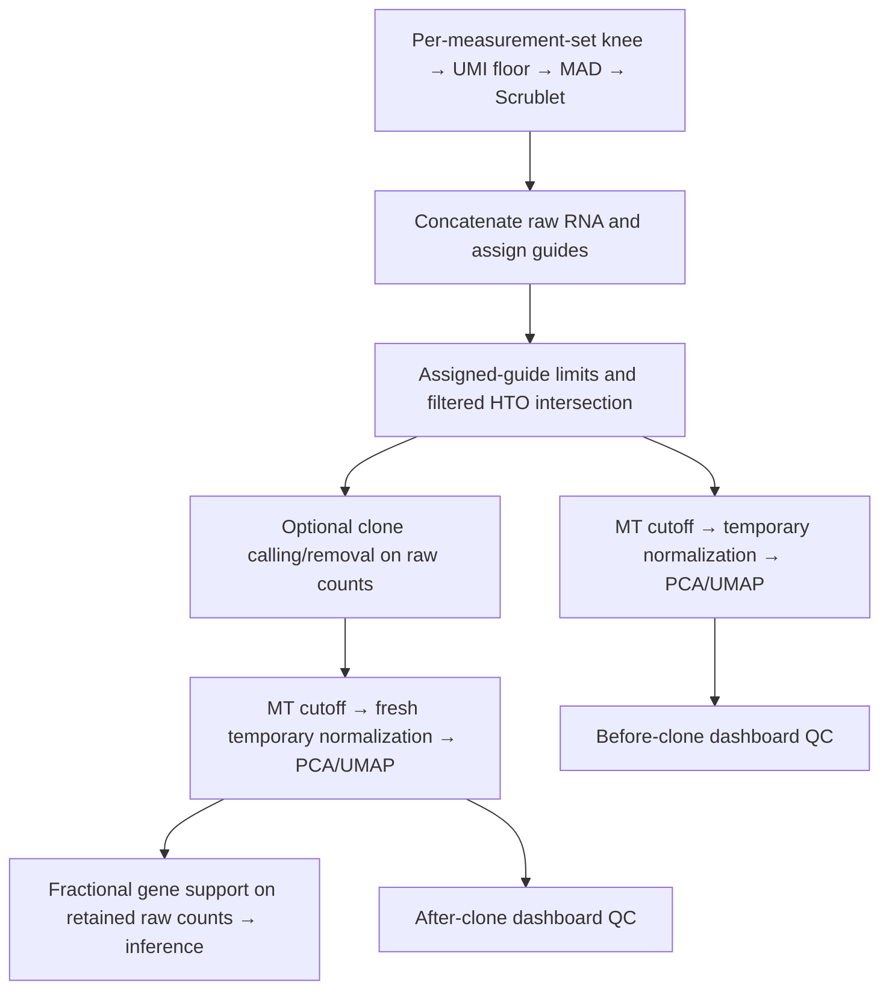

# Post-concatenation visualization QC

`ENABLE_POSTCONCAT_EMBEDDING_QC=true` enables the reconciled workflow. This feature
was compared with the supplied `tf_perturb_qc/1.0.qc_adata.py`,
`2.0.prepare_adata.py`, and `2.1.concatenate_normalize.py`.

## Order and data contract

1. Per measurement set: existing knee caller, RNA UMI floor, two-sided log1p
   count/gene MAD filters, optional Scrublet. These are not changed to the
   reference's inflection caller, upper-only caps, or fixed Scrublet threshold.
2. Concatenate raw RNA; retain the original per-cell mitochondrial percentages.
   Merge aligned RNA/guide/HTO modalities, perform guide assignment and keep
   cells with 1–15 assigned guides by default (both limits configurable).
3. For hashing assays, use filtered HTO singlets with sufficient positive-cell
   support, assessed within each measurement set. This now occurs before clone
   calling, following the updated requested intersection order.
4. Fork the qualified raw-count matrix. One branch applies `QC_pct_mito` then
   makes temporary normalized QC plots. The other calls/removes clones on the
   same **un-normalized, pre-mitochondrial** qualified cells.
5. If clone removal is enabled, the surviving original counts receive the same
   mitochondrial filter and a fresh, independent normalization/PCA/UMAP. This
   is not a subset of the first normalized matrix. Gene support is recomputed
   on retained cells with the existing strict fractional rule.
6. Only the final filtered **raw-count** MuData reaches inference. No normalized
   layer, PCA/UMAP vectors or neighbor graphs from this QC are added to it.

The physical concatenation still precedes assignment: assignment is performed
per measurement set and pooled afterward. Requiring a guide before assignment
would not be equivalent to this intersection. Non-targeting assigned guides
count as guides and are preserved.

## Normalization and plots

| Reference scripts | Existing pipeline | Reconciliation |
| --- | --- | --- |
| DropletUtils inflection, per tag | Knee per measurement set | Preserve requested knee method |
| Upper-only 5-MAD caps, Scrublet before caps | Two-sided 5-MAD then Scrublet | Preserve requested pipeline order |
| Absolute gene floor before Scrublet | Fractional support after concatenation | Keep fractional support, now on final retained cells |
| Positive assigned guides after pooling | Previously only upper guide limit | Require at least one assigned guide, configurable |
| MT 25/30% sweep | Single user cutoff | Single configurable cutoff, default 25% |
| Median-depth/log1p/HVG/scale/PCA50/neighbors15 | No matching pre/post-clone embeddings | Add matching visualization-only recipe |
| `diff_day` HVG covariate | No universal biological day annotation | Explicit optional HVG batch key |
| Private cell-cycle/plate annotations | Not available for all assays | Plot existing annotations; record missing ones |
| Saved normalized AnnData and embeddings | Counts required for inference | Do not save normalized matrices or embedding arrays |

When clone removal is disabled, the first branch supplies the final filtered
raw-count matrix and no duplicate after-clone embedding is computed.

The reference's uncorrected Scanpy recipe is used: median-depth total-count
normalization (`target_sum=None`), log1p, Seurat-flavor HVGs (maximum 6,000),
scaling clipped at 10, ARPACK PCA, neighbors, UMAP. Default requested dimensions
are 50 PCs and 15 neighbors. Small targeted panels use all expressed,
nonconstant genes and cap PCs at `min(requested, cells-1, genes-1)`.
`QC_EMBEDDING_hvg_batch_key` is empty by default: the reference's `diff_day`
cannot be assumed to exist in other datasets. Set it explicitly if appropriate.
It controls HVG selection only, not integration or batch correction.

Outputs under `postconcat_embedding_qc/{before_clone,after_clone}` include:

- RNA-depth/detected-gene scatter colored by mitochondrial fraction, MT
  histograms and log-count boxplots, before/after MT for every measurement set;
- per-set cell-retention table;
- raw-versus-log-normalized depth distributions;
- PCA variance-ratio and cumulative-variance curves and TSV;
- PCA/UMAP multipanels colored by measurement set, RNA depth, detected genes,
  MT percentage, assigned-guide count and any existing supported covariates;
- effective settings and omitted covariates in `embedding_qc_metrics.json`.

Private cell-cycle lists, Parse-specific plate maps, well annotations, and
Leiden composition tests are not invented or imported. Available cell-cycle
scores are visualized; absent scores are recorded as unavailable. Embeddings
are descriptive QC, not evidence that technical variation has been corrected.
Independent pre/post UMAP coordinates need not have matching orientation.

All computations run in the existing base container. No host packages are
installed. Scaling is memory guarded; no cells are silently subsampled.
The chr8 test sets `QC_pct_mito=25`; targeted panels may lack informative MT
genes, so a zero mitochondrial percentage does not establish low mitochondrial
content in the whole transcriptome.

Live dashboards collect published plots after each process completes; final
dashboards include the same panels through `additional_qc/embeddings`.
Existing upstream knee/MAD/Scrublet panels remain available rather than being
replaced by these post-concatenation views.
